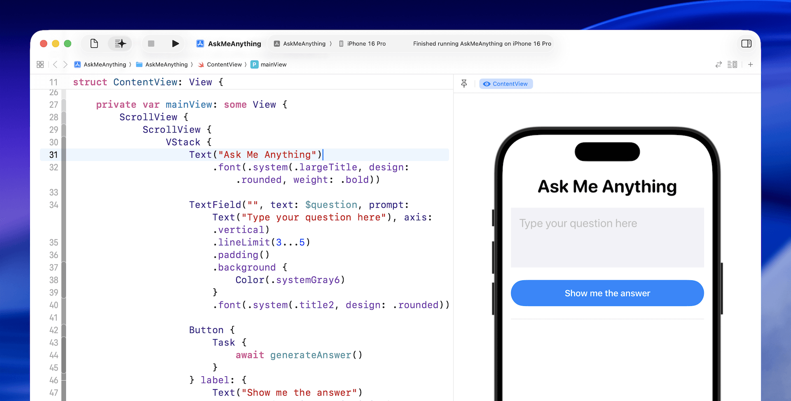

在 iOS 26 中，Apple 推出了 Foundation Models 框架，一個隱私優先、可在裝置上執行的 AI 工具組，讓 Apple Intelligence 背後的語言模型可以直接用於你的應用中。這個框架可在 iOS、macOS、iPadOS 和 visionOS 等平台使用，並提供一個簡潔的 Swift API，讓開發者能輕鬆整合先進 AI 功能。

與需要網路連線、在雲端伺服器上運行的 LLM（像是 ChatGPT 或 Claude）不同，Apple 的語言模型是設計來完全在本地裝置執行的。這種架構帶來了獨特的優勢：所有資料都保留在使用者的裝置上，確保隱私、更低延遲，以及離線可用性。

這個框架讓你可以立即建立各種智慧功能：產生與摘要內容、分類資訊，甚至打造語意搜尋與個人化學習體驗。不論你想製作智慧型的應用內導覽、為每位使用者生成個別內容，或加入對話式助理，你只需幾行 [Swift](https://www.appcoda.com.tw/swift) 程式碼就能實現。

在這篇教學中，我們將探索 [Foundation Models 框架](https://developer.apple.com/documentation/foundationmodels)。你將學會它是什麼、如何運作，以及如何使用它來透過 Apple 的裝置端語言模型生成內容。

請確保你已安裝 Xcode 26，並且 Mac 執行的是 macOS Tahoe，才能使用 Foundation Models 框架。

## 範例 App：Ask Me Anything


學習新框架最好的方式就是實作範例 App，而這正是我們在這份教學中要做的。我們將建立一個簡單但強大的 App，名為 **Ask Me Anything**，來探索 Apple 在 iOS 26 中推出的 Foundation Models 框架。

這個 App 讓使用者可以輸入任何問題，並透過 Apple 內建的語言模型在裝置上直接產生回覆。

透過建立這個範例 App，你將學會如何將 Foundation Models 整合進 [SwiftUI](https://www.appcoda.com.tw/swiftui)，並學習如何撰寫提示詞（prompt）與處理完整與部分的回應內容。

## 使用預設系統語言模型

Apple 提供一個名為 `SystemLanguageModel` 的內建模型，它可以存取驅動 Apple Intelligence 的裝置端語言模型。針對一般用途，你可以透過 `default` 屬性存取其「基礎版本」，這個模型針對文字生成任務進行最佳化，適合用於內容產生或問答功能。

你需要先匯入 `FoundationModels` 框架：

```
import FoundationModels
```

接著，你可以這樣取得預設的系統語言模型：

```
struct ContentView: View {
    
    private var model = SystemLanguageModel.default
    
    var body: some View {
        switch model.availability {
        case .available:
            mainView
        case .unavailable(let reason):
            Text(unavailableMessage(reason))
        }
    }
    
    private var mainView: some View {
        ScrollView {
            .
            .
            .
        }
    }

    private func unavailableMessage(_ reason: SystemLanguageModel.Availability.UnavailableReason) -> String {
        switch reason {
        case .deviceNotEligible:
            return "The device is not eligible for using Apple Intelligence."
        case .appleIntelligenceNotEnabled:
            return "Apple Intelligence is not enabled on this device."
        case .modelNotReady:
            return "The model isn't ready because it's downloading or because of other system reasons."
        @unknown default:
            return "The model is unavailable for an unknown reason."
        }
    }
}
```

由於 Foundation Models 僅適用於啟用 Apple Intelligence 的裝置，因此在使用前需先確認模型是否可用。你可以透過 `availability` 屬性檢查其狀態。

## 建立使用者介面

我們接著要建立 `mainView` 的 UI。首先加入兩個 `@State` 屬性來儲存使用者輸入的問題與產生的答案：

```
@State private var answer: String = ""
@State private var question: String = ""
```

然後更新 `mainView`：

```
private var mainView: some View {
    ScrollView {
        ScrollView {
            VStack {
                Text("Ask Me Anything")
                    .font(.system(.largeTitle, design: .rounded, weight: .bold))
                
                TextField("", text: $question, prompt: Text("Type your question here"), axis: .vertical)
                    .lineLimit(3...5)
                    .padding()
                    .background {
                        Color(.systemGray6)
                    }
                    .font(.system(.title2, design: .rounded))
                
                Button {

                } label: {
                    Text("Get answer")
                        .frame(maxWidth: .infinity)
                        .font(.headline)
                }
                .buttonStyle(.borderedProminent)
                .controlSize(.extraLarge)
                .padding(.top)
                
                Rectangle()
                    .frame(height: 1)
                    .foregroundColor(Color(.systemGray5))
                    .padding(.vertical)
                
                Text(LocalizedStringKey(answer))
                    .font(.system(.body, design: .rounded))
            }
            .padding()
        }

    }
}
```

這段 UI 程式碼相當簡單，只是加上了一些基本的樣式。



## 使用語言模型產生回應

接著我們來處理最核心的部分：將問題傳送給模型，並取得答案。我們新增一個 `generateAnswer()` 函式：

```
private func generateAnswer() async {
    let session = LanguageModelSession()
    do {
        let response = try await session.respond(to: question)
        answer = response.content
    } catch {
        answer = "Failed to answer the question: \(error.localizedDescription)"
    }
}
```

如你所見，只需要幾行程式碼就能將問題傳送給模型並取得產生的回應。首先，我們使用預設的系統語言模型建立一個 session。接著，將使用者的問題（也就是 prompt）透過 `respond` 方法傳給模型。

這個呼叫是非同步的，因為模型通常需要幾秒鐘（甚至更久）才能產生回應。一旦回應完成，我們就能透過 `content` 屬性取得產生的文字，並指定給 `answer` 來顯示在畫面上。

為了呼叫這個新函式，我們也需要這樣更新「Get Answer」按鈕的閉包：

```
Button {
    Task {
        await generateAnswer()
    }
} label: {
    Text("Show me the answer")
        .frame(maxWidth: .infinity)
        .font(.headline)
}
```

你可以在預覽面板或模擬器中測試 App，輸入問題、稍等幾秒，就會看到模型產生的答案。


## 重複使用同一個 Session

上述程式每次都建立新的 session，這適用於彼此無關的問題。但如果你希望使用者可以接續前一題問下去，保留對話上下文，就可以重複使用同一個 session。

將 session 宣告成一個 `@State` 屬性即可：

```
@State private var session = LanguageModelSession()
```

這樣模型就能記住前後關聯。例如先問：「去日本旅遊有什麼必吃的食物？」再接著問：「推薦幾家餐廳。」模型會理解你想找的是「日本的餐廳」。


如果你沒有重複使用同一個 session，模型將無法理解你追問的上下文。相反地，它會回覆類似以下的內容，請你提供更多細節：

「當然可以！為了給你最合適的建議，能否請你告訴我所在位置或你感興趣的料理類型？」

## 回應生成期間停用按鈕

因為模型需要一些時間生成回應，我們可以在生成期間停用按鈕，避免重複送出請求。`session` 物件提供 `isResponding` 屬性來檢查是否正在回應。

只需在按鈕加上 `.disabled(session.isResponding)` 修飾器：

```
Button {
    Task {
        await generateAnswer()
    }
} label: {
    .
    .
    .
}
.disabled(session.isResponding)
```

## 顯示串流回應（Streaming）

目前的使用者體驗並不理想——由於裝置端模型需要一些時間來產生回應，App 只能在整段回應完成後才顯示結果。

如果你用過 ChatGPT 或其他類似的 LLM，你可能會注意到它們幾乎是立即開始顯示部分內容，這種方式能帶來更順暢、即時的體驗。

Foundation Models 框架同樣支援串流輸出，讓你能在模型產生回應的同時即時顯示內容，而不必等到整段結果完成。要實作這功能，你可以改用 `streamResponse` 方法來取代 `respond` 方法。以下是支援串流回應的 `generateAnswer()`函式更新版本：

```
private func generateAnswer() async {
    
    do {
        answer = ""
        let stream = session.streamResponse(to: question)
        for try await streamData in stream {             
		        answer = streamData.asPartiallyGenerated()
        }
    } catch {
        answer = "Failed to answer the question: \(error.localizedDescription)"
    }
}
```

就跟使用 `respond` 方法一樣，呼叫 `streamResponse` 時你也是將使用者的問題傳給模型。主要的差別在於，你不需要等整段回應完成，而是可以逐步迴圈處理串流回傳的資料，並在每次接收到部分結果時即時更新 `answer` 變數——讓回應在生成的同時即時顯示在畫面上。

現在當你再次測試這個 App 並提出問題時，會看到回應逐步出現，帶來更即時、流暢的使用體驗。


## 自訂模型的使用指示（Instruction）

在建立模型 session 時，你可以選擇性地提供「指示」（instruction），用來自訂模型的使用情境。在這個範例 App 中，初始化時我們並沒有加上任何指示，因為這個 App 的設計目的是回答任何問題。

但如果你正在建立一個針對特定主題的問答系統，那麼就可能需要針對該主題提供具體的指示來調整模型行為。例如，如果你的 App 是專門用來回答旅遊相關問題的，你可以提供以下指示給模型：

*「你是一位知識豐富且親切的旅遊專家。你的工作是清楚且準確地回答使用者的旅遊相關問題。請專注於提供有用的建議、技巧與資訊，包括目的地、當地文化、交通、美食和行程規劃。語氣要自然、樂於助人且容易理解，就像是在和一位正在計畫下一趟旅行的人說話一樣。」*

撰寫指示時，你可以定義模型的角色（例如：旅遊專家）、指定回答內容的重點，甚至設定回應的語氣或風格。

若要將這段指示傳給模型，你可以像這樣建立 `session` 物件：

```
var session = LanguageModelSession(instructions: "your instruction")
```

## 總結

在這篇教學中，我們介紹了 Foundation Models 框架的基本概念，並示範如何使用 Apple 的裝置端語言模型來實作問答與內容產生等功能。

這只是起點——這個框架還有更多強大功能等待探索。在未來的教學中，我們將更深入介紹其他新特性，例如全新的 `@Generable` 與 `@Guide` 巨集，以及進一步的能力，如內容標註（content tagging）與工具呼叫（tool calling）。

如果你正在尋找方法來打造更智慧、具備 AI 功能的 App，現在正是開始探索 Foundation Models 框架，將裝置端智慧整合進你的專案的最佳時機。