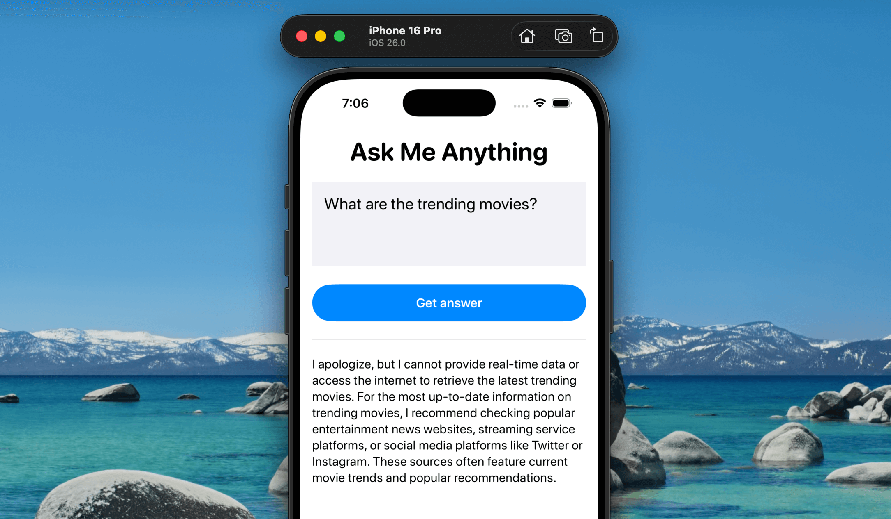
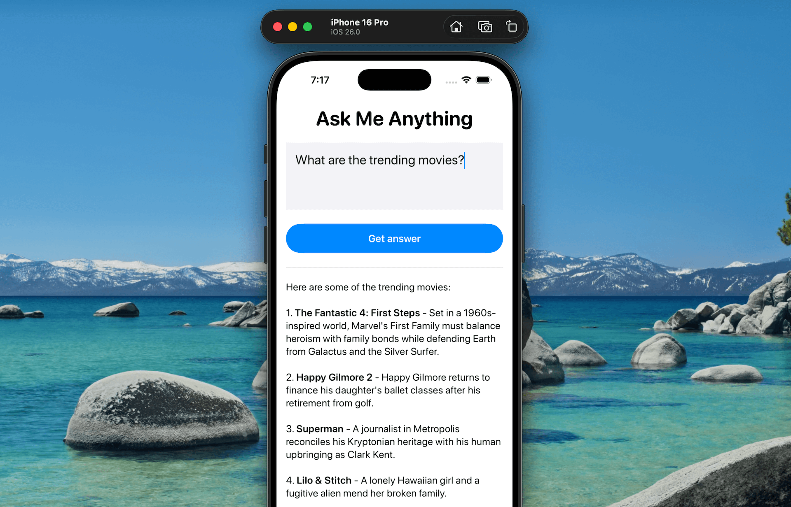

在前幾篇教學中，我們介紹了 Foundation Models 在 iOS 26 中的運作方式，以及如何使用這個全新框架打造具備 AI 功能的應用。我們也介紹了 [`@Generable` 巨集](https://www.appcoda.com.tw/generable/)，它能輕鬆地將模型回應轉換為結構化的 Swift 類型。

現在，在這個 [Foundation Models 系列](https://www.appcoda.com.tw/foundation-models/)的第三篇，我們要深入探討另一個強大的功能：**Tool Calling**。這個功能讓語言模型可以呼叫你 App 中的函式，來執行任務、擷取資料，或根據使用者輸入觸發操作。

裝置端語言模型無法回答所有問題，特別是需要即時資料的問題，例如目前天氣或最新股價。在其他情境下，你也可能希望模型能存取 App 中的資料來提供更準確的回應。這時就能用上 Tool Calling，它讓模型能將特定任務委派給 App 的函式或外部 API。

在這篇教學中，我們會繼續開發 **Ask Me Anything** App。雖然裝置端模型可以處理一般性的提問，但它無法即時知道目前熱門的電影。為了解決這個問題，我們會使用 Tool Calling 串接 The Movie Database（TMDB）API，讓模型能夠使用即時資料回答與電影相關的問題。



## 使用 TMDB API

如果你問 Ask Me Anything App 有關熱門電影的問題，裝置端語言模型不會知道答案——它無法存取這類即時資訊，可能只會建議你去其他地方查詢。我們可以透過 Tool Calling 串接 TMDB API 來解決這個問題。這樣一來，當使用者問到電影相關問題時，模型不會說「我不知道」，而是會自動呼叫外部 API，並直接在 App 中顯示相關資訊。

在 Xcode 專案中，建立一個 `MovieService` 檔案，並加入以下程式碼：

```
// Model for a Movie
struct Movie: Codable, Identifiable {
    let id: Int
    let title: String
    let overview: String
    
    // Coding keys to match API response
    enum CodingKeys: String, CodingKey {
        case id
        case title
        case overview
    }
}

// Model for the API response
struct TrendingMoviesResponse: Codable {
    let results: [Movie]
}

// Service class to fetch trending movies
class MovieService {
    // Base URL for TMDB API
    private let baseURL = "https://api.themoviedb.org/3"
    
    private let apiKey = "<your-api-key>"
    
    // Function to fetch trending movies using async/await
    func fetchTrendingMovies() async throws -> [Movie] {
        
        // Construct the URL for trending movies
        let urlString = "\(baseURL)/trending/movie/day?api_key=\(apiKey)"
        guard let url = URL(string: urlString) else {
            throw URLError(.badURL)
        }
        
        // Perform the network request
        let (data, response) = try await URLSession.shared.data(from: url)
        
        // Check for valid HTTP response
        guard let httpResponse = response as? HTTPURLResponse,
              (200...299).contains(httpResponse.statusCode) else {
            throw URLError(.badServerResponse)
        }
        
        // Decode the JSON response
        let decoder = JSONDecoder()
        let trendingResponse = try decoder.decode(TrendingMoviesResponse.self, from: data)
        return trendingResponse.results
    }
}
```

請務必將 `apiKey` 的值換成你自己的 TMDB API 金鑰。如果你還沒註冊帳號，可以前往 [themoviedb.org](https://www.themoviedb.org/) 免費註冊並取得你的 API 金鑰。

以上程式碼邏輯很簡單：它會呼叫網路 API 取得熱門電影，接著解析回應並轉換為 `Movie` 物件陣列。

## 在 Foundation Models 中使用 Tool Calling

接下來，我們要讓模型在使用者詢問熱門電影時自動執行 `MovieService` 中的程式。首先，建立一個名為 `GetTrendingMoviesTool.swift` 的新檔案，加入以下程式碼：

```
import FoundationModels

struct GetTrendingMoviesTool: Tool {
    let name = "getTrendingMovies"
    let description = "Get trending movies and their information"
    
    let service = MovieService()

    @Generable
    struct Arguments {
        
    }
    
    func call(arguments: Arguments) async throws -> [String] {
        let movies = try await service.fetchTrendingMovies()
       
        let formattedMovies = movies.map { movie in
            "\(movie.title): \(movie.overview)"
        }
        
        return formattedMovies
    }
}
```

我們建立了一個 `GetTrendingMoviesTool` 結構，並遵循 `Tool` 協定——這是 Foundation Models 中實作 Tool Calling 的標準方式。這個協定要求你指定工具的 `name` 和 `description`，並定義一個 `Arguments` 結構來表示工具需要的參數。這裡我們不需要額外的輸入，因此 `Arguments` 是空的。

如果你想根據類型篩選熱門電影，可以這樣定義 `Arguments`：

```
@Generable
struct Arguments {
		@Guide(description: "The genre to fetch trending movies")
		var genre: String
}
```

當模型觸發這個工具時，`call` 方法會自動執行。在這裡，我們呼叫 `fetchTrendingMovies()` 並將結果格式化成每部電影的標題與簡介。

現在這個工具已經準備好，要整合進 App 非常簡單。只要在 `ContentView` 中這樣初始化 `LanguageModelSession`：

```
@State private var session = LanguageModelSession(tools: [GetTrendingMoviesTool()])
```

透過 `tools` 參數你就可以把自訂工具提供給模型使用。就這樣！只要模型偵測到問題與熱門電影相關，就會自動呼叫 `GetTrendingMoviesTool`。

執行 App，再次輸入相同的問題。這次模型會成功地從 TMDB API 取得熱門電影資訊並顯示在畫面上。



## 總結

在這篇教學中，我們介紹了 Tool Calling——一個在 iOS 26 中加入 Foundation Models 框架的重要功能。與單純的文字生成不同，Tool Calling 讓裝置端語言模型可以與 App 的函式互動，或連接外部服務。

透過 Tool Calling，你可以大幅延伸模型的能力。不論是執行自訂邏輯，還是透過 API 擷取即時資料，模型現在都能執行更有情境的任務，而不只侷限於內建知識。

希望你喜歡這一系列教學，也期待你能開始打造更聰明、更具 AI 能力的 App！