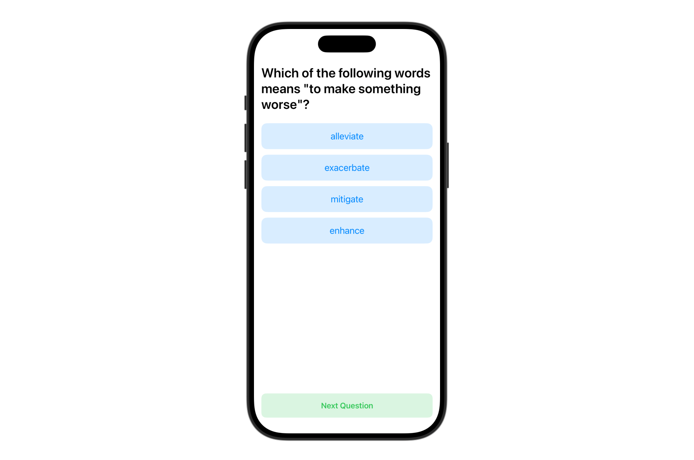

在[前一篇教學](https://www.appcoda.com.tw/foundation-models/)中，我們介紹了 Foundation Models 框架，並示範了如何用它來進行基本的內容生成。那個過程相當簡單——你提供一個提示詞（prompt），等幾秒鐘，就能獲得自然語言的回應。在我們的範例中，我們建立了一個簡單的問答 App，讓使用者可以提問，App 則直接顯示生成的文字。

但如果回應變得更複雜——你需要把非結構化文字轉換為結構化的物件呢？

舉例來說，假設你請模型產生一個食譜，然後你想把回應轉換成一個 `Recipe` 物件，裡面包含 `name`、`ingredients` 和 `instructions` 等屬性。

難道你需要手動解析文字並將每個欄位對應到資料模型嗎？

iOS 26 中的 Foundation Models 框架提供了兩個強大的新巨集：`@Generable` 和 `@Guide`，可以幫助開發者簡化這個流程。

在這篇教學中，我們將探索這些巨集的運作方式，以及如何利用它們從模型回應中直接產生結構化資料。

## 範例 App



我們將建立一個簡單的測驗 App，用來展示如何使用 Foundation Models 產生結構化內容。在這個案例中，我們會產生給英文學習者使用的單字測驗題目。

這個 App 會顯示一題多選題，包含四個選項，讓使用者可以互動地測驗自己的詞彙知識。每一題問題都是由裝置端語言模型產生，並透過 `@Generable` 巨集自動解析為 Swift 的 struct。

這個範例展示了開發者如何從基本的文字生成進一步運用 [Foundation Models](https://developer.apple.com/documentation/foundationmodels) 來建立結構化內容。

## 使用 @Generable 與 @Guide

我們開始來建構這個範例 App。如前所述，與之前的問答 App 不同，這次的測驗 App 會顯示一題有數個選項的選擇題。為了表示這個題目，我們會在 Swift 中定義以下的資料結構：

```
struct Question {
    let text: String
    let choices: [String]
    let answer: String
    let explanation: String
}
```

稍後，我們會請裝置端語言模型產生測驗題目。挑戰在於如何把模型產生的非結構化回應轉換成 `Question` 物件。幸好 Foundation Models 框架提供了 `@Generable` 巨集來簡化這個轉換過程。

要啟用自動轉換，只需要在 struct 上標記 `@Generable`，如下所示：

```
import FoundationModels

@Generable
struct Question {
    @Guide(description: "The quiz question")
    let text: String
    @Guide(.count(4))
    let choices: [String]
    let answer: String
    @Guide(description: "A brief explanation of why the answer is correct.")
    let explanation: String
}
```

這個框架同時也提供了 `@Guide` 巨集，讓開發者能針對各個屬性給模型更明確的指示。例如，如果每題都要有四個選項，你可以在 `choices` 陣列屬性上使用 `@Guide(.count(4))`。

針對陣列，你也可以使用以下的指引方式：

```
.minimumCount(3)
.maximumCount(100)
```

你也可以為屬性加上描述性的說明，幫助語言模型理解要產生什麼類型的資料，進而提升準確度與符合預期的程度。

值得注意的是，屬性的宣告順序很重要。使用 `@Generable` 的類型時，語言模型會依據程式中屬性的順序來逐一產生值。當某個屬性依賴前面某個屬性的值時，順序特別關鍵。例如在上面的程式中，`explanation` 會參考 `answer`，因此它必須宣告在 `answer` 之後。

## 建立測驗 App

現在我們有了 `Question` 結構，接著就可以著手實作測驗 App。在 `ContentView` 中更新程式碼如下：

```
import FoundationModels

struct ContentView: View {
    
    @State private var session = LanguageModelSession(instructions: "You are a high school English teacher.")
    
    @State private var question: Question?
    
    var body: some View {
        VStack(spacing: 20) {
            
            if let question {
                QuestionView(question: question)
            } else {
                ProgressView("Generating questions ...")
            }
            
            Spacer()
            
            Button("Next Question") {
                Task {
                    do {
                        question = nil
                        question = try await generateQuestion()
                    } catch {
                        print(error)
                    }
                }
            }
            .padding()
            .frame(maxWidth: .infinity)
            .background(Color.green.opacity(0.18))
            .foregroundStyle(.green)
            .font(.headline)
            .cornerRadius(10)

        }
        .padding(.horizontal)
        .task {
            do {
                question = try await generateQuestion()
            } catch {
                print(error)
            }
        }
    }
    
    func generateQuestion() async throws -> Question {
        
        let response = try await session.respond(to: "Create a vocabulary quiz for high school students. Generate one multiple-choice question that tests vocabulary knowledge.", generating: Question.self)
        
        return response.content
    }
}
```

這段 UI 程式碼非常直觀。但值得注意的是我們如何整合 Foundation Models 框架來產生測驗題目。在這個範例中，我們建立了一個 `LanguageModelSession`，並給予明確的指示，讓模型扮演一位英文老師的角色。

要產生題目，只需要使用 session 的 `respond` 方法，並透過 `generating` 參數指定期望的回應類型。模型會自動生成回應，並轉換成 `Question` 物件，省去你手動解析與對應資料的麻煩。

接下來，我們要實作 `QuestionView`，負責顯示測驗題目、處理使用者操作，並驗證答案是否正確。請將下列程式碼加到 `ContentView` 所在的檔案中：

```
struct QuestionView: View {
    let question: Question
    
    @State private var selectedAnswer: String? = nil
    @State private var didAnswer: Bool = false

    var body: some View {
        ScrollView {
            VStack(alignment: .leading) {
                Text(question.text)
                    .font(.title)
                    .fontWeight(.semibold)
                    .padding(.vertical)
                
                VStack(spacing: 12) {
                    ForEach(question.choices, id: \.self) { choice in
                        
                        Button {
                            if (!didAnswer) {
                                selectedAnswer = choice
                                didAnswer = true
                            }
                        } label: {
                            if !didAnswer {
                                Text(choice)
                            } else {
                                HStack {
                                    if choice == question.answer {
                                        Text("✅")
                                    } else if selectedAnswer == choice {
                                        Text("❌")
                                    }
                                    
                                    Text(choice)
                                }
                            }
                        }
                        .disabled(didAnswer)
                        .padding()
                        .frame(maxWidth: .infinity)
                        .background(Color.blue.opacity(0.15))
                        .foregroundStyle(.blue)
                        .font(.title3)
                        .cornerRadius(12)
                    }
                }
                
                if didAnswer {
                    VStack(alignment: .leading, spacing: 10) {
                        Text("正確答案是 \(question.answer)")
                        Text(question.explanation)
                    }
                    .font(.title3)
                    .padding(.top)
                }
            }
        }
    }
}
```

這個 View 會在畫面上顯示題目文字，接著列出四個選項按鈕。當使用者選擇某個選項時，畫面會以 ✅ 或 ❌ 顯示是否正確。答題後會顯示正確答案與說明。`@State` 屬性則負責追蹤使用者選擇的答案以及是否已回答，讓 UI 能即時更新。

完成所有程式碼後，你可以在 Xcode 的預覽畫面中測試 App。你應該會看到像下圖這樣的單字測驗題目，包含四個選項。在選擇其中一個後，App 會立即提供視覺回饋與答案解析。

## 總結

在這篇教學中，我們探索了如何在 iOS 26 中使用 Foundation Models 框架，透過 Swift 建立結構化內容。藉由打造一個簡單的單字測驗 App，我們示範了如何利用新的 `@Generable` 與 `@Guide` 巨集，將語言模型回傳的非結構化文字轉換成強型別的 Swift 結構。

敬請期待——我們將在下一篇教學中探索 Foundation Models 框架的另一個強大功能。